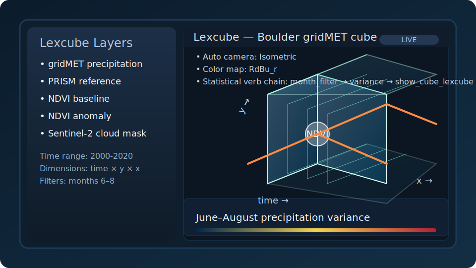

# Lexcube integration

Lexcube provides interactive 3D exploration of `(time, y, x)` climate cubes. CubeDynamics exposes both a pipe verb (`v.show_cube_lexcube`) and a functional helper (`cd.show_cube_lexcube`) so you can embed the widget anywhere in your workflow. The verb displays the widget as a side effect and returns the original cube so the pipe chain can continue unchanged.

## Example workflow

```python
import cubedynamics as cd
from cubedynamics import pipe, verbs as v

cube = cd.load_prism_cube(
    lat=40.0,
    lon=-105.25,
    start="2000-01-01",
    end="2020-12-31",
    variable="ppt",
)

# Focus on summer months and show the cube in Lexcube
pipe(cube) \
    | v.month_filter([6, 7, 8]) \
    | v.show_cube_lexcube(title="PRISM JJA precipitation", cmap="RdBu_r")
```

Behind the scenes the verb routes `(time, y, x)` data into Lexcube's widget API. As long as the cube is a 3D `xarray.DataArray` (or a Dataset with a single variable), the visualization launches instantly in a live notebook.

You can also call the helper directly when you are not inside a pipe:

```python
cd.show_cube_lexcube(cube, cmap="RdBu_r")
```

## Notebook-only behavior

Lexcube widgets run only in live Python environments (JupyterLab, VS Code, Colab, Binder). They will not render on the static documentation site, so screenshots and Binder links are provided for reference.



*The SVG is a stylized capture so the documentation can ship a "screenshot" without introducing binary assets.*

[🔗 Launch this example on Binder](https://mybinder.org/v2/gh/CU-ESIIL/climate_cube_math/HEAD?labpath=notebooks/lexcube_example.ipynb)
